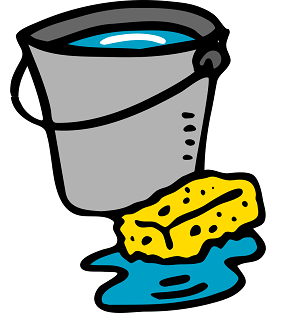

=======================
The Mop Project (alpha)
=======================
By Robert Fischer

Welcome to Mop project! Mop is an open source project written in Python.

.. image:: https://img.shields.io/badge/tests-current%20tests-yellow
https://github.com/robertfischer3/python-mop/blob/master/testingresults/test-16-dec-2019.html

![Github]https://img.shields.io/github/commit-activity/w/robertfischer3/python-mop
https://github.com/robertfischer3/python-mop/pulse

Why Mop? You need mop to clean up your cloud mess!

Organizations large and small love the agility of the cloud.  Most embrace the cloud for the ability to create compute
assets quickly. However, that creation process is usually weak in applying standards and compliance.  Let us face it cloud
governance is hard

The Mop project seeks to build cloud comprehensions to feed machine learning.  This open source project is in the nascent
stages. Currently the project framework in directed to adopting the framework controls found in the
three major cloud providers: Azure, AWS, and Google Cloud.

Why three public clouds? Why not focus on just one? Mop seek to foster the understand of utility computing by eventually
employing artificial intelligence to the comprehensions obtained by the framework.

Mop is open source Python project used to compile Public Cloud resource compliance information.  This project is in the
early stages of development focus first on Azure. However, efforts for AWS and Google Cloud are now underway.

Twelve Factor Development:
==========================
Mop strives to become a Twelve Factor application.  In the current alpha, the are parts of the application are not compliant
yet. However, the overall intention is to follow the Twelve Factor principles.

https://12factor.net/

Project Stages:
================
-Create a compliance reporting framework (in progress)

-Develop analysis layer to aggregate data (in progress)

-Apply machine learning to develop idea configuration models

Architectural Features
======================
This architecture makes use of the following techniques:
Metaprogramming
Object Relational Mapping (ORM)
Decorators
Composition
Templated Code
Cookie Current project template
Dynamic Service configuration
Code generating code
and more...

Active Deployments
=================
This project is being used and tested in one of the worlds largest companies. Since this testing provides an assessment of production security configurations, the test occurs in secure implementation. However, this project is looking for vendor sponsorship to enable Travis build reporting. 

License
========
* Free software: MIT license

Installation
============

::
This project makes heavy use of pipenv, which you likely need to install
    pip3 install pipenv

    pip3 install mop

You can also install the in-development version with::

    pip install https://github.com/robertfischer3/python-mop/archive/master.zip

Database
=============
This framework does not require the use of a database.  However, there are analysis code
blocks that make use of a database.  For this version, the framework makes use of a SQL Server
2019 for Linux docker image.  Microsoft provides a easy set up here:

Quickstart: Run SQL Server container images with Docker
https://docs.microsoft.com/en-us/sql/linux/quickstart-install-connect-docker?view=sql-server-ver15&pivots=cs1-bash#docker-demo

Framework Features
==================

Nanscent pluggable architectures using Pluggy

Easy data storage and analysis using databases and Alchemy ORM

.. image:: https://www.sqlalchemy.org/img/sqla_logo.png
    :width: 150px
    :align: left
    :height: 25px
    :alt: alternate text

Test Coverage
=============

This project currently calls directly against Azure services.  While Azure never charges for ingress traffic, outbound
traffic is charged.  Further the test results below has executed against a very large dataset.

The test dataset included over 490 Azure production subscriptions. This framework mines security information.  Hence hosting
this testing on Travis or others carry with it issues.  To protect the test data owners, the testing could only occur on private networks.  Given this product is alpha, there are still some bug fixes to be aware of.  The latest build and test result will
be posted here going forward:

https://github.com/robertfischer3/python-mop/blob/master/testingresults/test-16-dec-2019.html

Documentation
=============

Documentation is forthcoming...

https://python-mop.readthedocs.io/

Development
===========

To run the all tests run::

    tox

Note, to combine the coverage data from all the tox environments run:

.. list-table::
    :widths: 10 90
    :stub-columns: 1

    - - Windows
      - ::

            set PYTEST_ADDOPTS=--cov-append
            tox

    - - Other
      - ::

            PYTEST_ADDOPTS=--cov-append tox
